# FYI, the time in brackets shows how time much i (roughly) spent on that session

## 06.08.26
### Initial research (~3h)

So, new project yaay, for this project i wanna make some sort of device i could stick onto walls (walls in question being doors/windows too maybe?) and listen to whatevers going on on the other side  
Disclaimer:: im making this thing for https://ispy.hackclub.com fyi, incase ts looks weirder than my other projects :p  
Overall this was inspired by some laser mic videos i saw online a couple years ago and me trying to listen to some oral test in a classroom before me through my phone, also a couple years ago!! (i would never now though)

I never really worked with mics and such, and defo not with laser mics or anything, so i was completely clueless as where to even start...  
My first thought was to replicate the same thing the people have done in the laser mic videos on youtube, mainly by shining a laser onto a window and it reflecting onto a solar cell, whereas the vibrations of the deflected laser would be picked up due to the laser not being completely on the solar cell and therefore the output would change in intensity when the surface vibrated.  
Some setups i looked into looked like this:
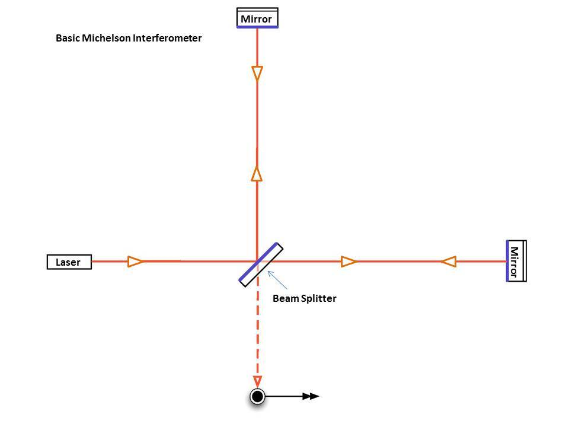
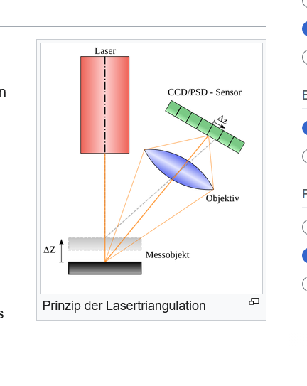

Whereas i liked the first approach more tbh, but the 2nd one is cool too. The only problem(s) with this are though that  
1. if i attached the laser and the probe mirror as per the first approach (theres one control and one probe mirror, the probe mirror is on the vibrating surface) to the same surface, from the lasers POV there wouldnt be any sound or vibrations, so it wouldnt work at all.
2. the 2nd approach wouldnt really work either due to point 1. and the fact that im trying to attach this to a door, which MIGHT not be as reflective as a mirror/window, so were not getting any response on that either...

After the cool laser idea has been shattered, i decided to look into some other types of mics and found out about contact mics! They seem to be pretty cheap, and, after checking out some questionable vids about guys building them, i liked their quality enough and decided to use them!
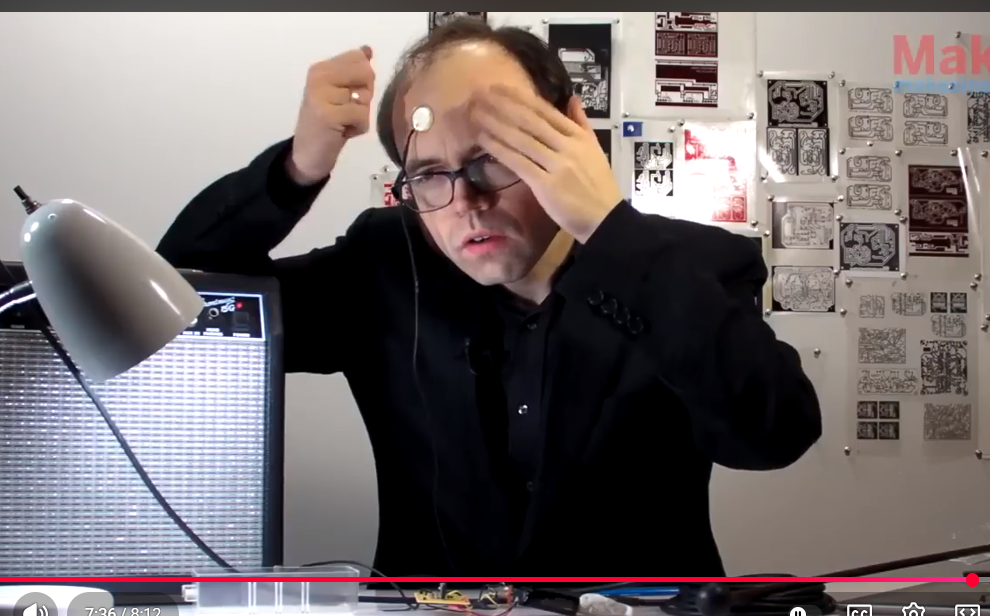
shoutout this cool guy from 14 years ago on [youtube](https://www.youtube.com/watch?v=aOJuCYgmPPE) for demonstrating all that

Also started doing some research on components to use in the project, and got some example schematics to maybe use later on! Turns out piezo discs are real cheap, so i can make lots of these is the pcb and components are also cheap!! (for education purposes only)

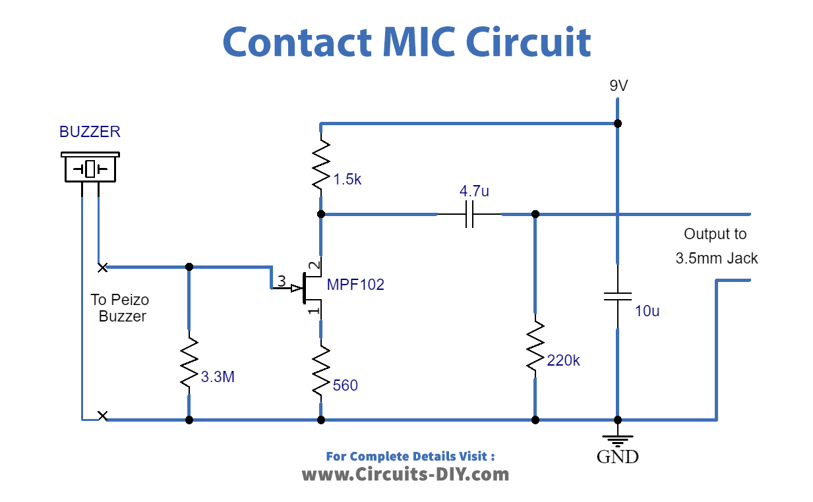

Thats all for now, ive got some more features in mind that id love to add, but its about midnight here and id probably work on this tmrw!

## 08.08.26
### More research (~3.5h)

As the title suggests, i did some more research on this stuff. Mainly messed around in falstad though with the circuit but there was a fair share of researching done!!
 
So, at first i tried copying the circuit above into falstad, and after searching it up, i could replace the mic with an AC source in series with a capacitor with the capacitance of the mic.

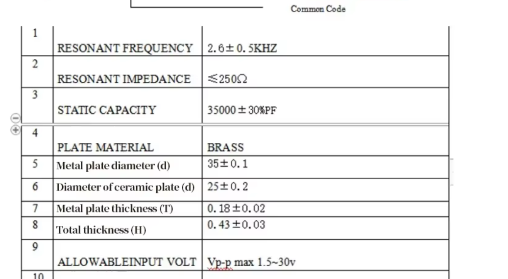
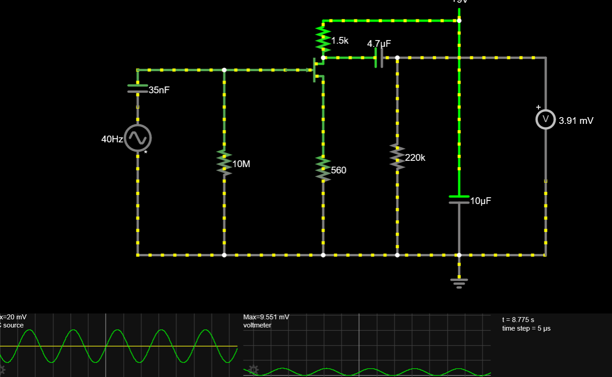

 

For some reason, even after messing around with it for a while, that didnt work at all, so after looking some more stuff up and trying different configurations i just gave up, until i discovered opamps exist!! That seemed to be way easier and i had a circuit working almost directly!

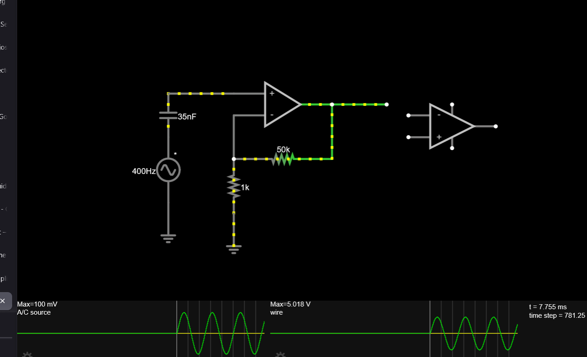

  
that was until i tried using a real opamp, which for some reason fucked everything up and just flatlined..

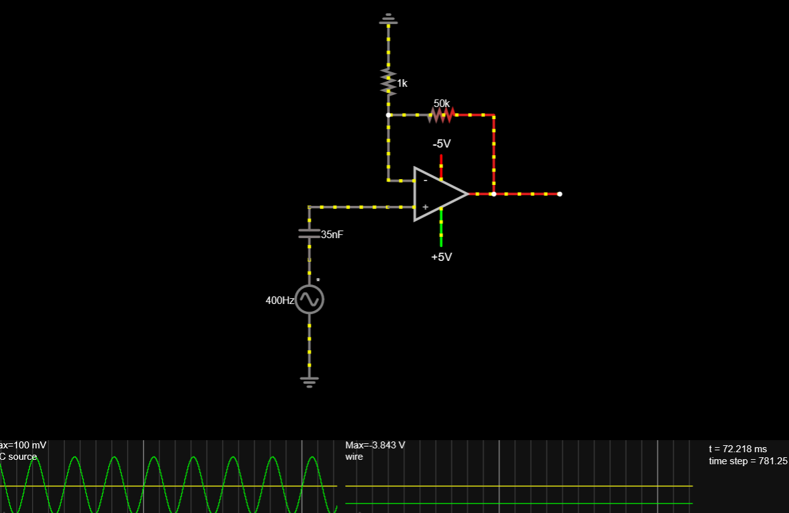
 

the fix for the flatline was me being dumb and having the polarity of the opamp power reversed, and turns out i needed a pulldown resistor for the wave maximum to not go down slowly after that, for some reason i cant be bothered to understand, im just glad this shit finally works

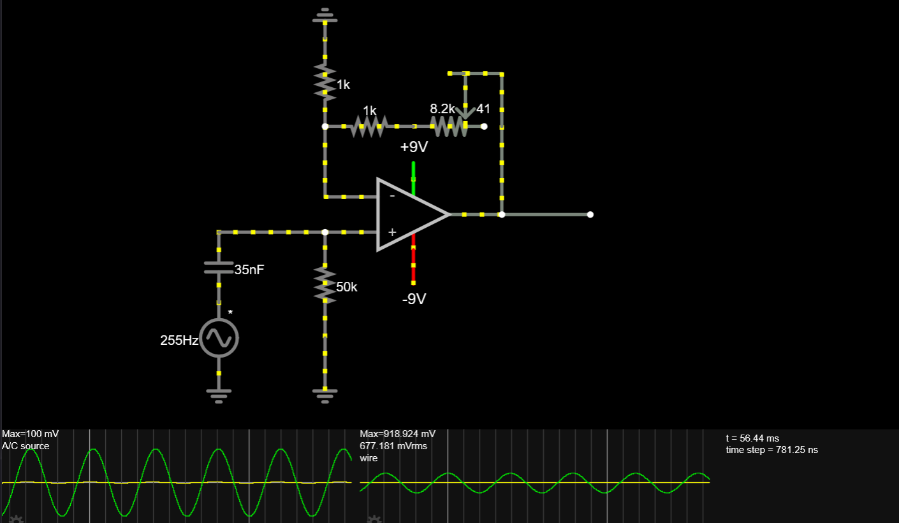

Also started doing the schematic in kicad, but that took waayy longer than i thought, since i cant just feed 9v into the average opamp IC, so i had to look into buck converters after first finding an IC thats good enough and understanding what all the specs are

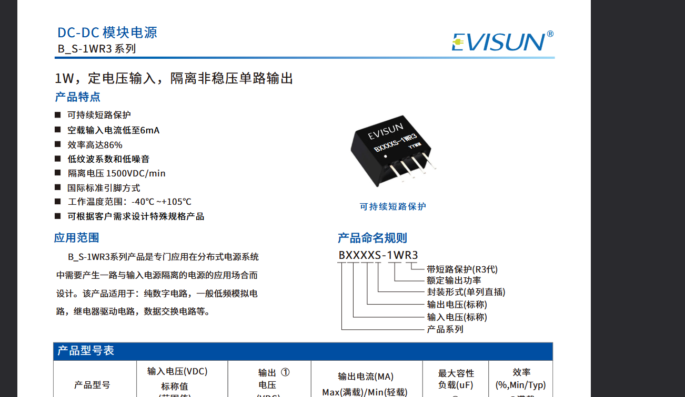

didnt help much either that the datasheets for buck converters are ALL in chineese

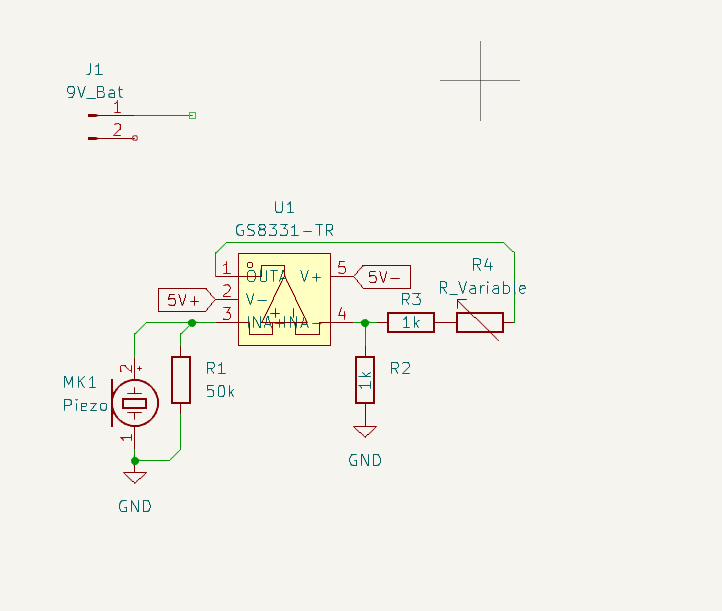

## 09.08.26
### Component search (~2h)

So, now ive got the main amp thingy ready, but the only problem is that i cant just feed 9V into it, due to the opamps maximum ratings. I looked for a while on lcsc for some bigger opamps, but couldnt find one thatd fit me.. the 2nd option would be to have a stepdown with/without a LDO, i already started looking for buck converters yesterday, but the only one i found had a max power of just 1W, and i wasnt really sure if thatd be enough for me, besides, its output was 5v afaik, and to convert those to a clean 5V with an LDO i need a value higher than 5v, for example 6 or 6.5v

 

Only problem with other stepdowns is that they have only one, positive output, which also kinda fucks with the whole opamp circuit. I tried replacing the ground with a certain voltage so the wave would be somewhat offset, but i could only achieve that with an exact voltage of 3v, above which the wave would cut off on the top.

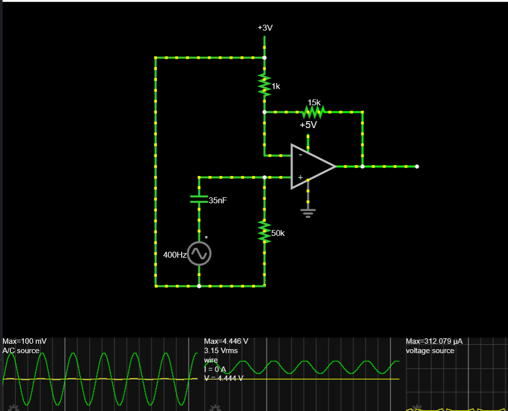
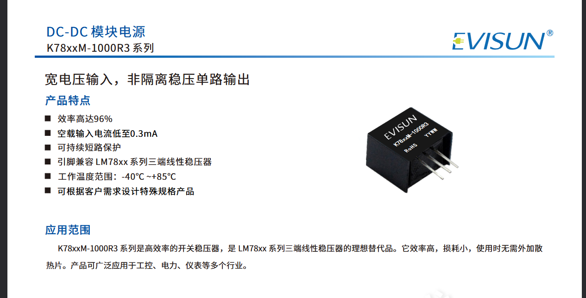

since this approach sucks, i just looked into how i can invert a signal or something, but didnt really find a nice enough solution... while writing this journal though i stumbled upon the perfect buck converter, even though this one drops the voltage to 5v, but idgaf at this point and one single 1$ IC can give me both the negative and positive output i needed

### Power stuffs (~2h)

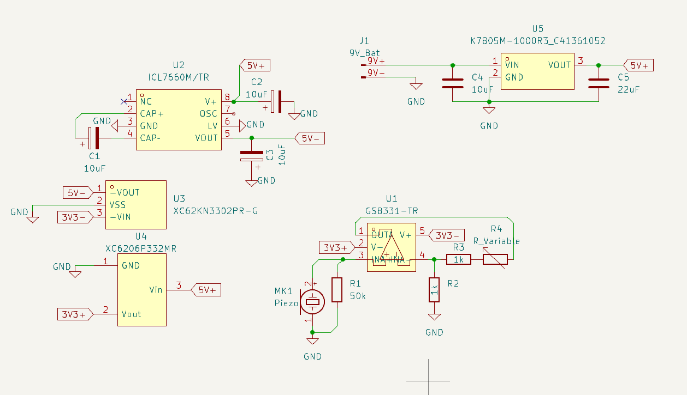
So, forget whatever i said about the buck converter last journal, that IC could indeed not give both positive and negative outputs, sadly :/ after digging some more, i just decided to get an inverter for the negative signal. Didnt really wanna do this, but im hoping ill get a decently clean signal from both LDOs. Other than that, i think i should be almost fully done with the pcb part of this! just gotta add a potentiometer and headphone port, or add different output methods if i feel like it!!

## 15.08.26
### More power stuffs and hopefully finishing the PCB now (~1h)
Back again, been procrastinating this for a whiiiile because of some other stuff i had to finish before this.

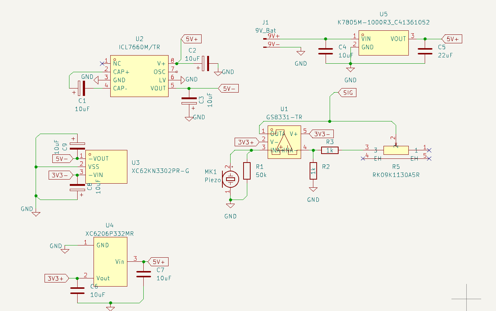

all my components from my cart got voided when i made a new cart on lcsc, so i had to go find all of them again... while i was at it though i coincidentially checked the datasheets just one more time and noticed i fucked up the wiring on some of the components and i was missing some capacitors here and there. After fixing that and going through all components one more time, i added the variable resistor to my schematic! Pretty sure this should hopefully be all for now, all im missing is the signal part of the output.

## 16.08.26
